# VitalSense — System Design Document

**Status:** Implementation-ready MVP architecture  
**Platform:** Native Android application  
**Primary stack:** Kotlin, Jetpack Compose, MVVM, Repository pattern, Hilt, Coroutines/Flow, Room, WorkManager, Firebase, ML Kit, Google Maps, Android SMS  

## 1. Executive Summary

VitalSense is one offline-first Android application for Admin, ASHA Worker, Doctor, and Patient roles. A single authenticated user experience selects a role-specific navigation graph, while shared domain services protect data access independently of the UI. The application uses Room as the local source of truth for fast and reliable reads, Firebase as the remote synchronization and notification platform, WorkManager for durable background work, and explicit authorization relationships for ASHA proxy access.

The design is appropriate for rural healthcare because core patient records, the Health Card, previously viewed reports, drafts, and queued actions remain usable without connectivity. Network access is treated as a synchronization opportunity rather than a prerequisite for ordinary reads. Sensitive medical records are versioned and audited; OCR is assistive only and always requires human verification; disease trends are anonymized village-level indicators rather than diagnoses.

## 2. Architecture Goals and Constraints

| Goal | Design response |
|---|---|
| Offline-first operation | Room-backed repositories, local-first reads, outbox writes, WorkManager sync |
| Low bandwidth | Small JSON payloads, thumbnails, pagination, retries, cached reference data |
| Secure health-data handling | Firebase Auth, custom claims, Firestore/Storage Rules, encrypted local storage, audit logs |
| Four roles in one app | Shared codebase with role resolution and protected role graphs |
| ASHA proxy access | Explicit patient–ASHA relationship, scoped permissions, consent and audit trail |
| Localization | Android resources, runtime language switch, localized dynamic content |
| Maintainability | Feature boundaries, MVVM, use cases, repositories, Hilt modules |
| Reliability | Idempotent operations, durable outbox, retry/backoff, conflict states |
| Testability | Interfaces around data sources, fake repositories, deterministic use cases |

Constraints include Android device limitations, intermittent 2G/3G connectivity, uncertain GPS/SMS availability, prototype-grade OCR, Firebase's cloud dependency for synchronization, and the PRD's explicitly mocked dispensary and government-scheme data. The MVP does not include payments, video consultation, full EHR interoperability, multi-district administration, or wearable integration.

## 3. System Context

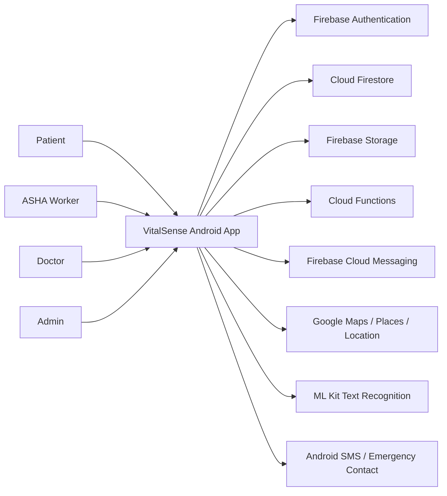

Firebase Authentication owns identity and tokens. Firestore stores structured records and relationship projections. Storage stores encrypted-at-rest media objects whose access is controlled by Storage Rules. Cloud Functions perform trusted aggregation, notifications, and server-side validation that must not rely on a client. FCM delivers online push notifications. Google Maps, Places, and Fused Location Provider support facility discovery and location capture. ML Kit performs on-device OCR. Android SMS provides the no-data SOS fallback when the device has a capable SIM and the required permission.

## 4. High-Level Architecture

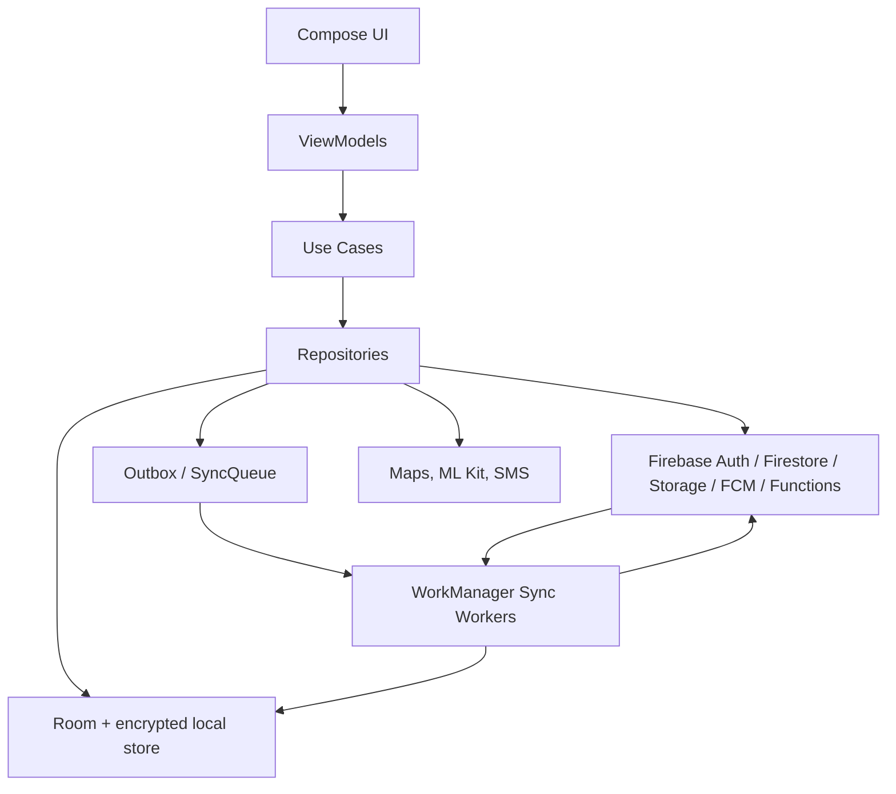

Dependency direction is inward: UI depends on ViewModels, ViewModels invoke use cases, use cases depend on repository interfaces, and repository implementations coordinate local and remote sources. Domain code does not depend on Compose, Firebase SDK types, or Android UI classes. The repository writes locally first, emits Room Flow updates immediately, and schedules remote synchronization.

### Android layered architecture

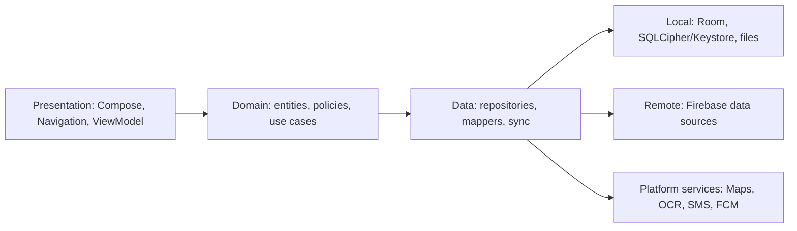

## 5. Android Application Architecture

Compose screens render immutable UI state from ViewModels. ViewModels expose `StateFlow` for screen state and accept user intents. Use cases represent business operations such as `CreateHealthCase`, `AcceptHelperLink`, `CreatePrescription`, `QueueDocumentUpload`, and `RequestAppointment`. Repositories combine local and remote data sources and return domain models rather than SDK models.

The `SyncManager` observes connectivity and the outbox, while WorkManager executes constrained, retryable jobs. `AuthenticationManager` observes Firebase session state, refreshes tokens, and resolves account status and claims. `NotificationHandler` converts FCM payloads into local notifications and persisted notification records. `LocationManager` isolates permission and location-provider behavior. `OcrManager` validates images, invokes ML Kit, and returns raw text plus confidence metadata. `FileManager` writes app-private files, creates thumbnails, hashes content, and queues uploads.

## 6. Feature Architecture

Features are isolated by business capability, with shared cross-cutting code in `core`.

| Feature | Boundary and responsibilities |
|---|---|
| Authentication | Registration, login, reset, verification, session and account status |
| Admin | Villages, regions, staff review, broadcasts, aggregate heat map, mock stock |
| ASHA | Caseload, helper relationships, proxy mode, notices and patient chat |
| Doctor | Assigned/referral queue, responses, prescriptions, specialty, appointments |
| Patient health | Health Card, condition entry, symptoms, history and risk summary |
| Prescriptions/OCR | Capture, OCR, parser, verification, structured history |
| Appointments | Proposals, confirmation, rescheduling, cancellation and reminders |
| Chat | Conversations, queued messages, delivery/read states |
| Documents | Secure metadata, local files, upload/download and versioning |
| Maps | Location permission, facilities, cached last-known results |
| Schemes | Curated content, eligibility and offline browsing |
| Wellness | Mood check-ins, breathing content, referral escalation |
| SOS | Confirmation, location, SMS fallback, notification and SOS event |
| Help/localization | Inline instructions, manual, language preference and accessibility |

Features communicate through use cases and shared domain identifiers, not direct access to another feature's database tables. Shared components include Health Card summaries, notifications, authorization context, sync state, and audit creation.

## 7. Role-Based Navigation

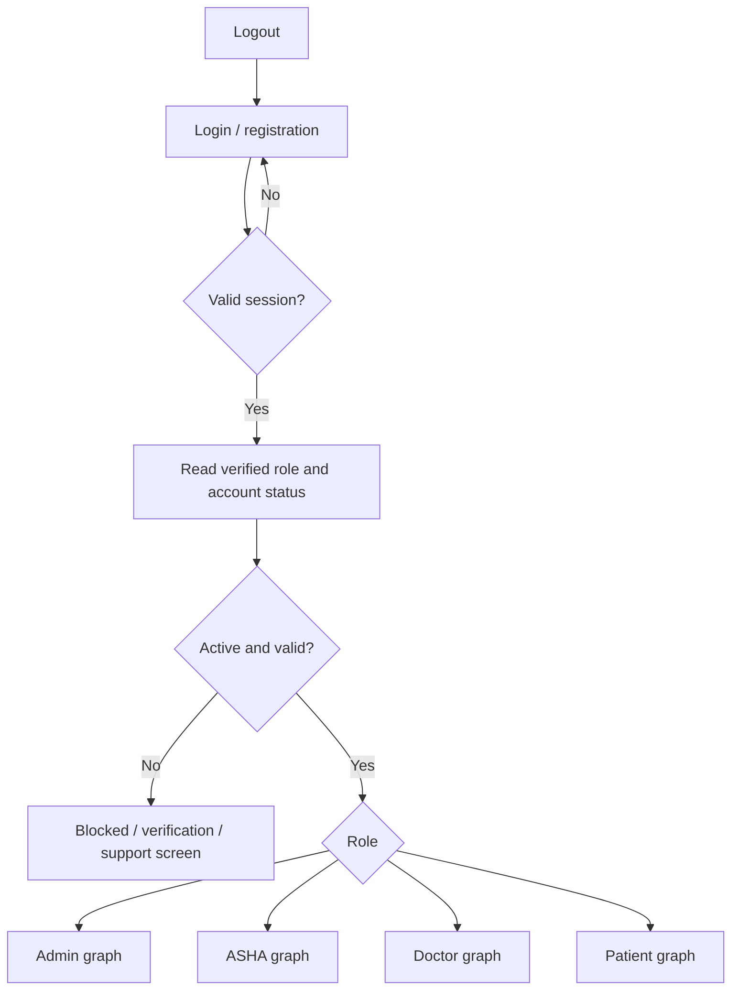

Role routing is a presentation convenience, not a security boundary. Claims are read from the authenticated identity and corroborated by an active user profile. Unknown, missing, suspended, or stale roles route to a non-operational account-status screen. Logout clears the Firebase session, sensitive in-memory state, local role context, and any device-specific notification token association. On expiry, the app attempts token refresh; failure returns to login while preserving only non-sensitive drafts in encrypted local storage.

## 8. Authentication Architecture

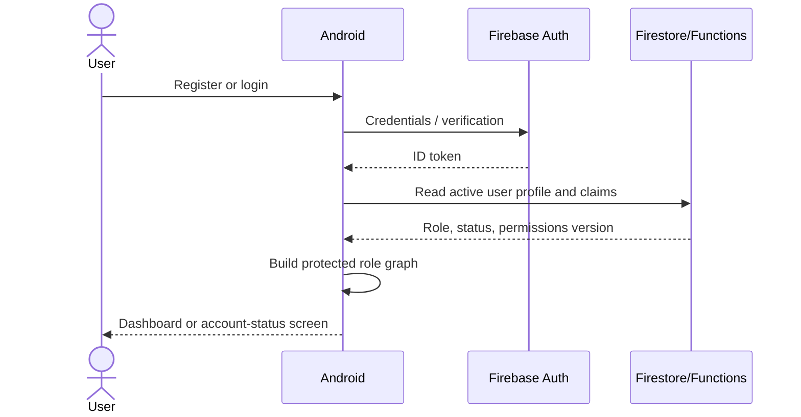

Registration creates an identity and a minimal user profile. Staff roles require admin review before activation according to the recommended resolution of the PRD open question; patient self-registration can activate after verification. Login persists Firebase's session only through the supported SDK, never a raw password. Password reset uses Firebase's verified flow. Token refresh occurs through the SDK; every sensitive operation rechecks server-side authorization. Authentication proves identity; authorization determines what that identity may do.

## 9. Authorization and RBAC

| Capability | Admin | ASHA | Doctor | Patient |
|---|:---:|:---:|:---:|:---:|
| Manage villages/regions | C/U | — | — | — |
| Review staff accounts | C/U | — | — | — |
| Heat map and trends | R | — | — | — |
| Broadcast notices | All/targeted | Own patients | — | — |
| Register patient | — | C | — | C |
| View patient records | Aggregate/admin scope | Caseload/helper scope | Assigned/referred scope | Own scope |
| Create health case | — | Proxy | — | Own |
| Respond/prescribe | — | — | Assigned case | — |
| Appointments | — | Proxy | Assigned/proposed | Own |
| Documents/OCR | — | Proxy | — | Own |
| Schemes/map | — | R | — | R |
| Mental wellness | — | Proxy | Referral recipient | Own |
| SOS | — | Receives alert | — | Trigger |
| Audit logs | Authorized operational view | Own actions | Own actions | Own actions |

Rules combine role, resource ownership, assignment, relationship, and record state. A patient can access records where `patientId == auth.uid` or where the patient has explicitly authorized the acting ASHA. An ASHA's role alone grants no patient access. Doctors can read cases assigned or referred to them and can write responses only while the case is actionable. Admin access is broad operational access but should use aggregate views where individual clinical data is unnecessary. Every write is validated again by trusted backend rules or functions.

## 10. ASHA Proxy Access

The relationship is represented by a first-class `PatientASHA` record with patient ID, ASHA ID, status, scopes, created/accepted/revoked timestamps, consent source, and version. The MVP permits multiple helpers only when each relationship is explicit; a patient may revoke any helper. Caseload membership is a separate operational relationship and does not automatically equal unlimited proxy authority.

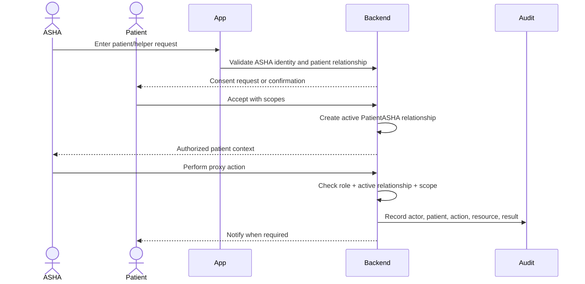

The acting identity is always the ASHA, while the target identity is the patient. Proxy requests carry an explicit `actingAsPatientId`; the backend derives the relationship and rejects client-supplied privilege claims. Proxy actions include the actor, target, role, relationship ID, resource ID, operation ID, timestamp, source device, result, and before/after metadata where safe. Consent revocation blocks new actions immediately; already-created medical records remain immutable and auditable.

## 11. Data Architecture

The canonical logical entities are listed below. Firestore may denormalize read projections, but every record retains stable IDs and ownership fields.

| Entity | Key fields and relationships |
|---|---|
| User | `userId`, role, status, language, village/region, verification timestamps |
| Patient | `patientId`, user reference, village, emergency contacts, risk summary |
| Doctor | `doctorId`, user reference, specialty, approval status, facility |
| ASHAWorker | `ashaId`, user reference, unique shareable ID, village, status |
| Village/Region | IDs, names, parent region, centroid/boundary metadata |
| PatientASHA | patient, ASHA, status, scopes, consent and revocation timestamps |
| HealthCase | patient, creator, category, severity, requested specialty, state, version |
| Symptom | case, normalized category, severity, recorded time, source actor |
| DoctorResponse | case, doctor, text, version, immutable timestamp |
| Prescription | patient, doctor/case, items, status, date/time, version, source |
| Medicine/DispensaryStock | mock medicine, quantity, checkpoint/availability timestamp |
| Appointment | patient, doctor, proposer, timeslot, state, version, conflict flag |
| MedicalDocument | patient, storage path, type, checksum, metadata, access and version state |
| Message | conversation, sender/target, body, timestamps, delivery/read/sync state |
| Notification | recipient, event type, localized payload key, read state, source event |
| GovernmentScheme | title, eligibility, benefits, documents, language, source, updated time |
| SOSEvent | patient, trigger actor, location quality, SMS/push results, timestamp |
| DiseaseTrend | village/region, category, time bucket, counts, severity metrics, threshold state |
| MoodCheckIn/WellnessContent | patient/mood or curated content, locale, timestamps, sync state |
| AuditLog | actor, target patient, resource, action, relationship, result, timestamp |
| SyncQueue | operation ID, entity, payload reference, attempt count, state, next retry |

Every mutable local record has a stable UUID, `createdAt`, `updatedAt`, `serverVersion` or ETag equivalent, `deletedAt` when tombstoned, and `syncState`. Medical responses, prescriptions, and reports are append-only versions; corrections create a new version or explicit correction event rather than silently overwriting history.

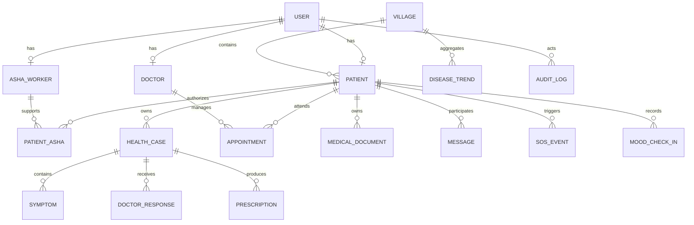

## 12. Local Database Architecture

Room stores the records needed for local-first rendering: the Health Card projection, own/caseload records permitted for the current session, previously opened reports, prescriptions, appointments, conversations, cached facilities, schemes, instructions, notification records, drafts, and the outbox. Room is not an authorization bypass: queries are scoped by the active user and data is removed or rekeyed on logout where policy requires.

Sensitive local data is encrypted using SQLCipher or equivalent Room-compatible encryption, with keys protected by Android Keystore. Media remains in app-private storage, encrypted where supported, and is referenced by checksum and local path. Server-only data such as complete aggregate administration records or unneeded raw cloud payloads is not cached. Timestamps are UTC instants rendered in the selected locale. A monotonic operation ID prevents duplicate sync submissions.

Room is the UI source of truth; Firestore is the remote source of shared truth. Firestore's client persistence does not replace Room because Room owns derived projections, outbox state, instruction flags, encryption policy, and application-specific sync metadata.

## 13. Remote Firestore Architecture

Recommended top-level collections are `users`, `patients`, `doctors`, `ashaWorkers`, `patientAsha`, `healthCases`, `prescriptions`, `appointments`, `conversations`, `messages`, `medicalDocuments`, `notifications`, `villages`, `schemes`, `trendAggregates`, `auditLogs`, and `sosEvents`. Large or high-cardinality records such as messages may use subcollections, for example `conversations/{conversationId}/messages/{messageId}`. Storage paths follow `patients/{patientId}/documents/{documentId}/{versionId}`.

Denormalized fields such as `patientId`, `villageId`, `specialty`, `status`, and `updatedAt` are intentional query keys. Required indexes cover case queue by doctor/status/time, appointments by participant/state/start time, notifications by recipient/read/time, and trends by geography/category/time bucket. Paginate all lists with stable ordering and document cursors. Do not query broad collections from the client when a scoped projection or callable function is sufficient.

Trusted Cloud Functions handle role-sensitive operations such as claim updates, trend aggregation, appointment transactions, notification fan-out, and audit creation. Firestore Rules enforce authentication, ownership, relationship checks, immutable-field constraints, and allowed state transitions. Client writes never assign their own role, audit actor, aggregate totals, or authorization relationship status.

## 14. Offline-First Architecture

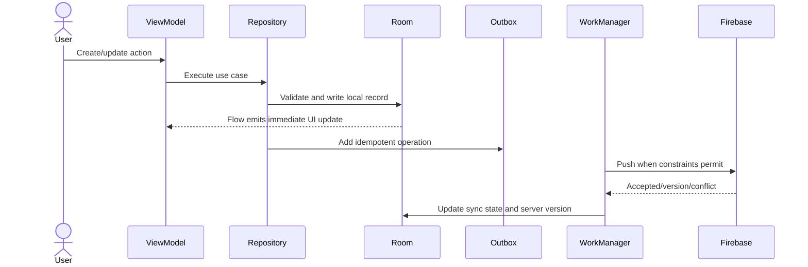

Reads always prefer Room. Offline creates receive a client UUID and `PENDING_SYNC` state. Updates use a patch or new version, and deletes use tombstones until the server confirms. WorkManager applies network and battery constraints, exponential backoff with jitter, bounded retries, and a durable failed state requiring user-visible recovery. Partial success is recorded per operation; a failed document does not block unrelated symptom synchronization.

Each operation includes `operationId`, entity ID, base version, actor ID, relationship ID if proxy, payload checksum, created time, and attempt count. Server functions are idempotent on `operationId`, preventing duplicate prescriptions, messages, appointments, or SOS events after retries.

## 15. Synchronization and Conflict Resolution

Simple last-write-wins is acceptable only for low-risk preferences, instruction-dismissal flags, and non-clinical cached metadata. Health severity conflicts create a review state. Prescriptions, doctor responses, medical documents, and completed appointments are immutable or versioned; a later correction references the prior version. Appointment proposals are accepted through a server transaction that checks slot availability and current state, preventing double booking.

Conflict processing compares base version with current server version. If equal, the operation is applied. If different, the worker downloads the authoritative record and either merges non-overlapping fields, creates a conflict record for a critical field, or rejects the operation with a safe explanation. No medical record is silently discarded. The UI shows pending, synced, conflict, and failed states and permits an authorized human to review rather than exposing raw merge mechanics to a patient.

## 16. Medical Record Architecture

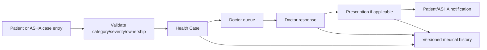

A case is the clinical workflow container. Symptoms and uploaded reports may support it. A doctor response is linked to the case and the responding doctor. A prescription references the case and patient and contains immutable item versions. Historical records remain available according to authorization and retention policy. Health Card data is a derived projection, never the sole clinical source.

## 17. Prescription Lifecycle

Doctors create a draft prescription for an assigned case. The backend validates doctor authorization, patient/case linkage, medicine identifiers, dosage fields, quantity, and status transition. A finalized prescription is timestamped, versioned, notified, and added to patient history. The prototype stock view reads a hardcoded repository dataset and displays availability without claiming a reservation or real-time inventory guarantee. Future stock integration can replace that repository.

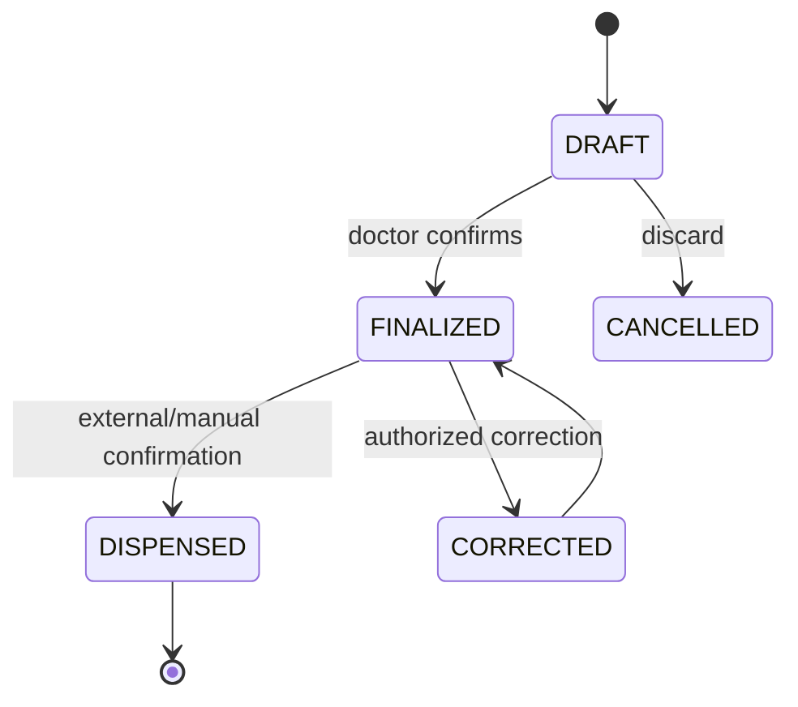

## 18. Prescription OCR Architecture

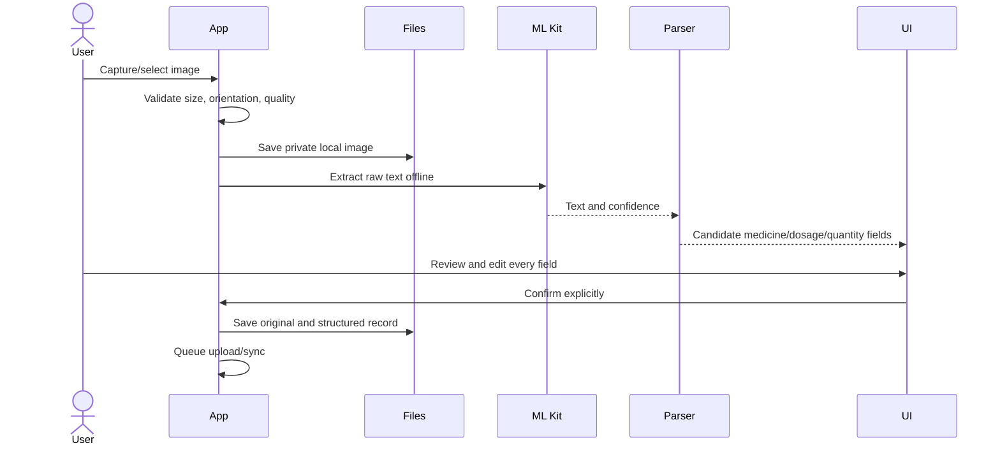

The pipeline rejects unusable images, offers recapture guidance, and preserves the original. Handwriting, blur, mixed languages, and abbreviations can produce low-confidence or incorrect output. A heuristic parser maps common labels and medicine candidates but never medically verifies content. Optional online structuring/translation may be used only with explicit privacy controls; offline fallback is manual editing. The saved record includes source type, OCR confidence, parser version, verification actor, and confirmation timestamp.

## 19. Appointment Architecture

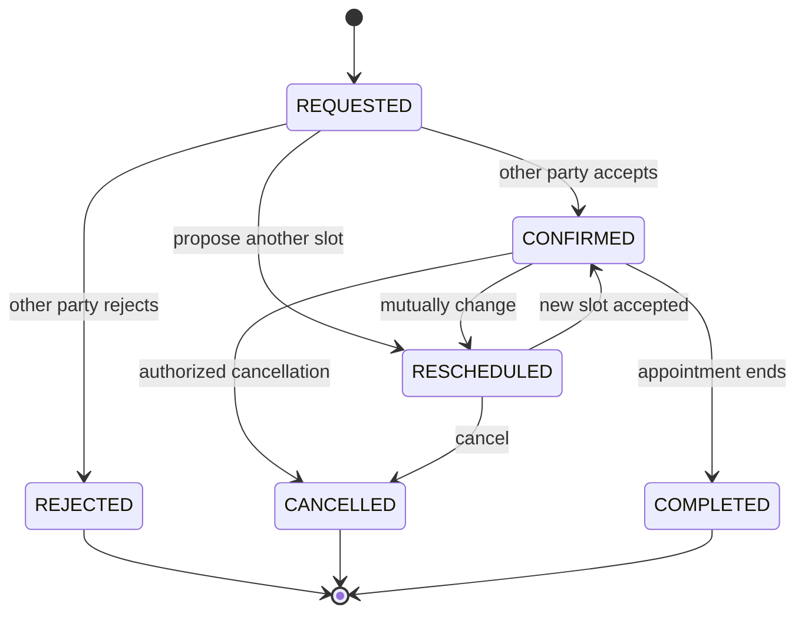

Patient, ASHA proxy, or doctor can propose a slot. The server transaction checks participant authorization, current state, timezone-normalized interval, and conflicts before confirmation. Notifications are generated on each meaningful state transition. Offline proposals remain pending; final confirmation requires authoritative synchronization.

## 20. Chat Architecture

A conversation contains participants and relationship scope. Messages contain sender, recipient/conversation, body or attachment reference, client ID, created time, delivery state, read state, and sync state. Firestore listeners provide online updates; Room provides offline history. A new offline message is immediately shown as `PENDING`, then becomes `SENT`, `DELIVERED`, `READ`, or `FAILED`. SMS-style queued behavior means the UI remains useful but must not represent pending content as delivered clinical communication.

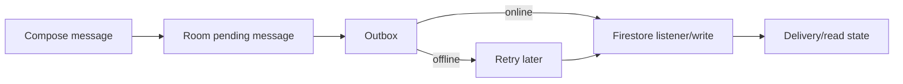

## 21. Medical Documents

Documents use generated IDs rather than user filenames: `patientId/documentId/versionId`. Metadata includes type, MIME type, byte size, checksum, capture time, uploader, acting patient, relationship ID, local path, cloud path, and sync state. File size and MIME allowlists protect the upload path. The original is immutable; replacement is a new version. Deletion creates a tombstone and invokes authorized cloud deletion, subject to retention policy. Storage Rules require patient ownership or an active authorized relationship, while doctor access requires case linkage.

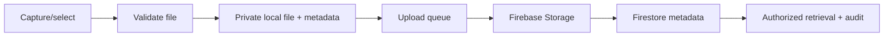

## 22. Health Card

The Health Card is a locally materialized projection generated from patient identity, village, helper relationship, latest validated case severity, recent history, prescriptions, appointments, emergency information, and last successful update time. Room refreshes the projection whenever permitted source records change. It remains viewable offline and clearly displays its last-sync timestamp. Sharing is an explicit user action and should export only the minimum fields needed; it must not bypass authorization to underlying records.

## 23. Disease Trends and Heat Map

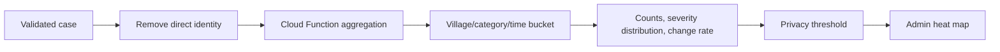

A Cloud Function consumes validated case events and updates village-level time buckets. Metrics include case count, symptom/category frequency, severity weighting, recent change, and village comparison. Aggregates enforce a minimum group threshold where appropriate and never expose patient IDs. The app labels results as trend indicators, not diagnoses or confirmed outbreaks. Admin filters by category, severity, geography, and time range; refresh targets under five minutes in online mode.

## 24. Maps and Nearby Healthcare

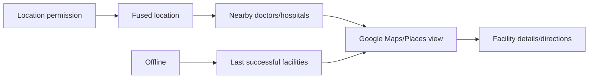

The app requests location with an icon-led rationale and offers approximate/manual village selection when permission is denied. If GPS is unavailable, it uses the last known location or village centroid and labels the limitation. Offline mode shows cached facilities and last-known metadata; map tiles and routing may be unavailable. The UI must not imply current availability when data is stale.

## 25. SOS Architecture

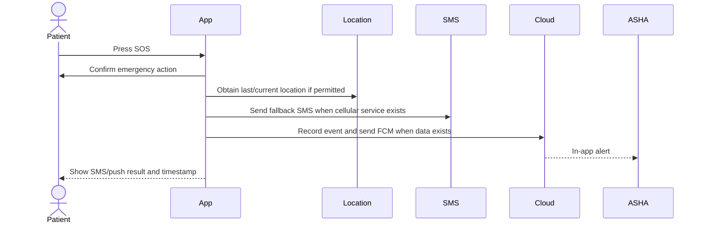

The SOS payload contains patient identity, timestamp, last known location when available, and the configured contact. `SmsManager` or the default SMS intent is subject to SIM, carrier, permission, device, and Android policy limitations. If SMS is unavailable, the app clearly reports failure and presents configured alternatives; it must never claim that emergency services were contacted. VitalSense is not a replacement for official emergency services. Every event records SMS and push outcomes without logging unnecessary medical details.

## 26. Government Schemes

Admins maintain curated scheme records with title, category, eligibility, benefits, required documents, source, languages, and updated timestamp. Patients and ASHA workers query role-appropriate records, filter locally, and cache the last successful set. Content is informational and displays its source/update date; it does not make an eligibility determination unless explicitly configured as a simple informational rule.

## 27. Mental Wellness

Mood and stress check-ins are stored locally first and optionally synchronized as sensitive health data. Offline wellness content includes icon-led breathing and relaxation exercises. A high-risk or concerning check-in creates a referral path to the ASHA or psychologist-type doctor, using the same consent and authorization model as other cases. The app provides supportive guidance and escalation information but does not diagnose, predict, or autonomously classify a mental illness.

## 28. Notifications

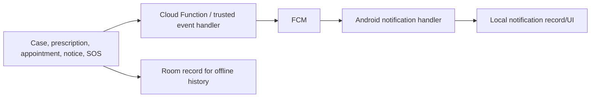

Notifications are event-driven and localized at render time where possible. FCM is best-effort; the underlying notification record remains in Firestore and Room. If notification permission is denied, the in-app notification center remains available. Offline-created events are persisted locally and delivered after synchronization. Critical SOS uses the separate SMS path.

## 29. Localization

Static UI text and accessibility descriptions use `strings.xml` resource bundles. A language preference is stored locally and, when permitted, in the user profile. The in-app switcher applies the language without requiring a device-locale change; missing translations fall back to the default language. Dynamic schemes, notices, and help content use language-keyed fields or localized content documents with a clear fallback. OCR output is raw source text until verified; optional translation must be visible as translation, not as original prescription text.

## 30. Security Architecture

Firebase Auth establishes identity. Custom claims express the coarse role, while Firestore and Storage Rules enforce ownership, relationship, assignment, state, and immutable-field restrictions. Sensitive data uses TLS in transit and provider encryption at rest. Local Room encryption uses a Keystore-protected key. Tokens are held by the supported SDK and never written to logs. API keys are supplied through build configuration/secrets management and are not committed.

Consent is explicit for helper relationships and document sharing. Data minimization applies to notifications, analytics, logs, and heat maps. Security controls described here do not constitute legal or regulatory compliance; legal, clinical, retention, breach-response, and regional data requirements remain open decisions.

### Conceptual Firebase Rules strategy

```text
allow read: if signedIn()
  && (isOwner(resource.data.patientId)
      || activeHelper(resource.data.patientId)
      || assignedDoctor(resource.data)
      || isAdminForOperationalView());

allow create: if signedIn()
  && actorMayCreate(request.resource.data)
  && immutableActorFieldsMatch();

allow update: if signedIn()
  && actorMayUpdate(resource.data, request.resource.data)
  && protectedFieldsUnchanged()
  && validStateTransition();

allow delete: if false; // use audited tombstones or trusted functions
```

These are representative policies, not copy-paste production rules. Exact expressions depend on the final schema and claim model. High-risk operations should use callable Functions or transactions so the server can create audit logs and notifications atomically.

## 31. ASHA Consent and Audit Model

Sensitive actions write an `AuditLog` with actor ID, target patient ID, resource type/ID, action, role, relationship ID, source (`patient`, `asha_proxy`, `doctor`, `admin`, `system`), timestamp, operation ID, result, and safe metadata. Audit records are append-only and readable only to authorized operational roles. Examples include patient profile changes, ASHA symptom entry, ASHA document upload, doctor prescription creation, doctor case response, and admin account review. Audit logs support accountability and incident investigation without storing raw message bodies or full prescription contents unnecessarily.

## 32. Threat Model

| Threat | Impact | Mitigation |
|---|---|---|
| Unauthorized patient access | Privacy and clinical harm | Ownership checks, scoped queries, Rules, encrypted local DB |
| ASHA privilege abuse | Proxy misuse | Explicit consent/scopes, revocation, audit, least privilege |
| Role escalation | System-wide access | Server-controlled claims, admin review, immutable role fields |
| Fake staff accounts | Unsafe advice | Verification/approval workflow and account status |
| Token theft | Account compromise | SDK token handling, short-lived refresh behavior, logout/revocation |
| Insecure documents | Sensitive file leakage | Storage Rules, opaque paths, MIME/size checks, signed access only when needed |
| Malicious uploads | Device/backend risk | Allowlist, size limits, checksum, safe rendering, malware scanning path for production |
| OCR manipulation/error | Incorrect prescription | Original preservation, confidence, mandatory human review |
| Replay/duplicate operations | Duplicate clinical actions | Operation IDs, idempotent Functions, server version checks |
| Unauthorized API calls | Data modification | Authenticated Rules, callable validation, rate limits |
| Sync manipulation | Lost or altered records | Versioning, signatures/claims, conflict state, audit |
| Appointment race | Double booking | Server transaction and state machine |

## 33. Backend Service Boundaries

Firebase services are used directly where appropriate rather than inventing a REST layer. Authentication handles identity and reset. User/role functions manage profiles and claims. Patient and ASHA services validate ownership and relationships. Doctor services manage specialty and assignments. Case and prescription services validate clinical workflow and immutable versions. Appointment functions perform transactional state changes. Document services issue authorized metadata/storage operations. Notification functions fan out events. Scheme services expose curated content. Trend functions aggregate anonymized buckets. SOS services record outcomes and coordinate FCM, while Android independently handles SMS fallback.

Each service follows input validation, authorization, processing, output mapping, and typed error handling. Client input is untrusted. Errors expose stable codes such as `UNAUTHENTICATED`, `FORBIDDEN`, `CONFLICT`, `INVALID_ARGUMENT`, `RETRYABLE`, and `FAILED_PRECONDITION`, not sensitive backend details.

## 34. Error Handling

| Error | User experience | Local behavior | Retry/recovery |
|---|---|---|---|
| No/slow internet | Offline banner and cached content | Read Room; queue writes | WorkManager retry with backoff |
| Server failure | Non-blocking error with status | Keep pending state | Retry if transient; show failed action |
| Auth failure/expiry | Re-authentication screen | Preserve safe drafts only | Refresh once, then login |
| OCR failure | Recapture or manual entry | Preserve original image | Retry locally; never auto-save |
| Camera/location denied | Explain consequence and alternative | Use gallery/manual village/cache | User can change permission later |
| SMS unavailable | State that SMS was not sent | Record result | Retry only if user explicitly chooses |
| Invalid ASHA ID | Clear validation message | Do not create relationship | Correct ID and resubmit |
| Unauthorized access | Generic unavailable message | No sensitive cache expansion | Re-resolve role/relationship |
| Duplicate appointment | Explain slot conflict | Mark conflict | Choose another slot |
| Sync conflict | Review-needed state | Preserve both versions | Authorized resolution |
| Upload failure | Keep document pending | Retain local file | Retry/resume or cancel |
| Database failure | Safe error and support path | Avoid destructive retry | Reopen/recover; report diagnostic ID |

## 35. Observability and Auditability

Application logs use structured event names, severity, operation IDs, and anonymized identifiers. They may include screen, latency, sync state, error code, and service name. They must not include patient names, health conditions, prescription contents, private messages, raw OCR text, document bytes, access tokens, or precise location unless an explicit audited operational need exists. Crash reporting is configured with privacy filters. Performance monitoring measures cold start, Health Card render time, Room query latency, upload duration, and sync success rate. Backend logs track function duration, rule denials, retries, and aggregate processing without clinical payloads. Audit logs are separate from diagnostics and retain accountability events.

## 36. Project / Module Structure

```text
com.vitalsense.app/
  core/
    model/              # domain models and identifiers
    common/             # results, errors, clocks, dispatchers
    auth/               # session and claims abstractions
    database/           # Room entities, DAOs, migrations
    security/           # encryption, permission policy
    network/            # Firebase adapters and DTOs
    storage/            # private media and upload adapters
    sync/               # outbox and WorkManager workers
    location/           # location abstraction
    ui/theme/           # Compose theme and shared components
  feature/
    auth/
    admin/
    asha/
    doctor/
    patient/
    health/
    prescriptions/
    appointments/
    chat/
    documents/
    maps/
    schemes/
    wellness/
    sos/
    help/
  navigation/
  di/
  MainActivity.kt
```

Each feature owns its screens, ViewModels, use cases, and feature-specific repository interfaces. Core modules are stable and reviewed more strictly. The navigation module owns route contracts but not business rules. Database migrations are centralized and versioned.

## 37. Multi-Developer Architecture

A four-person allocation can be: Developer 1 owns authentication, core security, database, and sync; Developer 2 owns patient health, Health Card, prescriptions, and OCR; Developer 3 owns ASHA, doctor, proxy authorization, chat, and appointments; Developer 4 owns admin, trends, maps, SOS, schemes, and notifications. A lead reviewer owns navigation contracts and release integration.

Developers use short-lived feature branches, small pull requests, required unit tests, one reviewer from the owning area plus one cross-area reviewer for security or schema changes, and protected main/staging branches. Shared UI and core changes require an API proposal before implementation. Database migrations are additive, backward-compatible where possible, and owned by the database maintainer. Feature modules communicate through documented interfaces to minimize merge conflicts.

## 38. Testing Architecture

Unit tests cover use cases, ViewModels, repository decisions, RBAC policies, conflict resolution, retry/idempotency, appointment state transitions, and OCR parsing. Integration tests cover Room migrations, encrypted storage, repository synchronization, Firebase emulators, and transaction behavior. Compose UI tests cover role routing, forms, help instructions, OCR verification, offline indicators, and accessibility labels. Security tests exercise ownership, ASHA revocation, doctor assignment, document Rules, role escalation, and unauthorized reads. Offline tests simulate no network, intermittent connectivity, duplicate operations, partial sync, and critical conflicts. OCR fixtures cover printed, blurred, incomplete, mixed-language, and manually corrected prescriptions.

## 39. Deployment Architecture

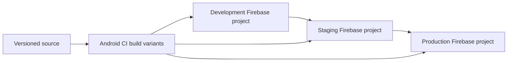

Use separate Firebase projects and Android build variants for development, staging, and production. Configuration selects project IDs and non-secret API identifiers per variant. Secrets, signing keys, service-account credentials, and API restrictions are stored in CI secret storage, never source control. Release builds are signed with protected keys and distributed first to internal testing. Firestore indexes and Functions are versioned and promoted through reviewed deployment steps. Rollback uses the prior signed APK and backward-compatible schema/function releases; destructive migrations require a staged plan.

## 40. Architecture Decisions

### ADR-001 — Offline-first architecture

**Context:** Rural connectivity is intermittent and the Health Card/core flows must work offline. **Decision:** Room is the local UI source of truth; writes use an outbox and WorkManager. **Reason:** Immediate reads and durable recovery. **Trade-off:** More sync code and conflict states.

### ADR-002 — Single role-aware Android application

**Context:** Four roles share records and workflows. **Decision:** One Compose application with protected role graphs. **Reason:** Shared domain logic and lower duplication. **Trade-off:** Navigation and authorization boundaries require discipline.

### ADR-003 — Explicit ASHA proxy model

**Context:** ASHA workers assist patients but should not receive unrestricted access. **Decision:** First-class consented relationship with scopes, revocation, and audit. **Reason:** Least privilege and accountability. **Trade-off:** Additional relationship lifecycle and Rule complexity.

### ADR-004 — Room plus Firebase

**Context:** Prototype needs local projections and rapid real-time cloud services. **Decision:** Room for app-local truth and Firebase for shared backend/sync. **Reason:** Fits the selected stack and MVP velocity. **Trade-off:** Two data models and synchronization overhead.

### ADR-005 — OCR requires human verification

**Context:** Prescription OCR is safety-sensitive. **Decision:** OCR creates editable candidates only. **Reason:** Handwriting and image quality make automatic medical verification unsafe. **Trade-off:** User effort remains mandatory.

### ADR-006 — Immutable/versioned medical records

**Context:** Silent overwrites can erase clinically meaningful history. **Decision:** Responses, prescriptions, and reports are versioned or append-only. **Reason:** Traceability and safe conflict handling. **Trade-off:** More storage and history UI.

### ADR-007 — Village-level trend aggregation

**Context:** Admin needs early trend visibility without exposing patient identity. **Decision:** Aggregate by village/category/time bucket with privacy thresholds. **Reason:** Supports the PRD metric while minimizing disclosure. **Trade-off:** Small groups may be hidden and trends are not diagnoses.

## 41. Known Limitations

OCR can fail on handwriting, blur, abbreviations, or mixed languages. Google Maps and routing may be incomplete offline. GPS can be unavailable indoors, and SMS requires cellular capability, a SIM, carrier support, and permission. FCM and Firestore synchronization require connectivity. Prototype dispensary stock is hardcoded and government schemes are curated rather than live. Trend indicators can be delayed, sparse, or non-representative and are not confirmed outbreaks. Firebase's suitability for future legal, compliance, scale, and interoperability needs must be reassessed.

## 42. Future Scalability

The repository interfaces permit replacement of Firebase with a custom service backed by PostgreSQL/PostGIS and object storage if scale or compliance requires it. Trend aggregation can move to a dedicated analytics pipeline. Maps can integrate verified facility APIs; dispensary inventory can become a transactional external service; OCR can evolve toward specialized multilingual models; telemedicine and richer provider verification can be added as separate capabilities. These are future paths, not MVP commitments.

## 43. Open Architecture Decisions

| Open issue | Recommended resolution before production |
|---|---|
| Launch languages and translation owner | Select languages with community review and assign translation stewardship |
| Health-data legal/compliance requirements | Obtain legal/privacy review, retention policy, consent wording, and incident process |
| Secondary SOS contact | Define default, consent, fallback order, and emergency-service messaging |
| Staff activation | Require admin approval before doctor/ASHA activation for MVP |
| ASHA caseload size | Conduct field testing and choose pagination/search thresholds |
| Minimum trend threshold | Set threshold with privacy review and document suppression behavior |
| Cloud OCR/translation | Require explicit consent, data-processing review, and opt-out before enabling |

## 44. Architecture Consistency Check

| Check | Status |
|---|---|
| Major PRD requirements have technical paths | Yes |
| Technologies in TECH_STACK have defined roles | Yes |
| No unnecessary major technologies introduced | Yes |
| Four roles and authorization paths defined | Yes |
| ASHA proxy access is explicit and audited | Yes |
| Offline reads, writes, retries, and recovery defined | Yes |
| Critical medical conflicts avoid silent overwrite | Yes |
| OCR requires human verification | Yes |
| Prescription history and appointment states preserved | Yes |
| SOS and Maps limitations documented | Yes |
| Notifications and localization have failure behavior | Yes |
| Heat map protects patient identity | Yes |
| Wellness avoids autonomous diagnosis | Yes |
| Security, audit, testing, and deployment are defined | Yes |
| Remaining contradictions are surfaced as open decisions | Yes |

## 45. Implementation Sequence

The recommended implementation order is to establish the Android project, Firebase environments, authentication, encrypted Room schema, role resolution, and shared design system first. Next implement patient Health Card and condition entry with offline outbox behavior, then ASHA relationships and proxy auditing, followed by doctor review, prescription lifecycle, and appointments. Add documents/OCR, chat, notifications, maps, schemes, wellness, SOS, and admin aggregation in feature increments. Each increment should include emulator-backed Rules tests, offline tests, and a migration before the next dependent feature.

A feature is implementation-ready when its local schema, remote projection, repository contract, authorization policy, sync behavior, error states, audit events, localization strings, tests, and navigation route are defined. This keeps the system aligned with both the product requirements and the selected technology stack.
