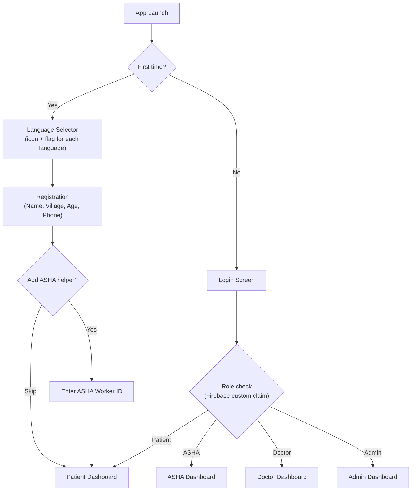
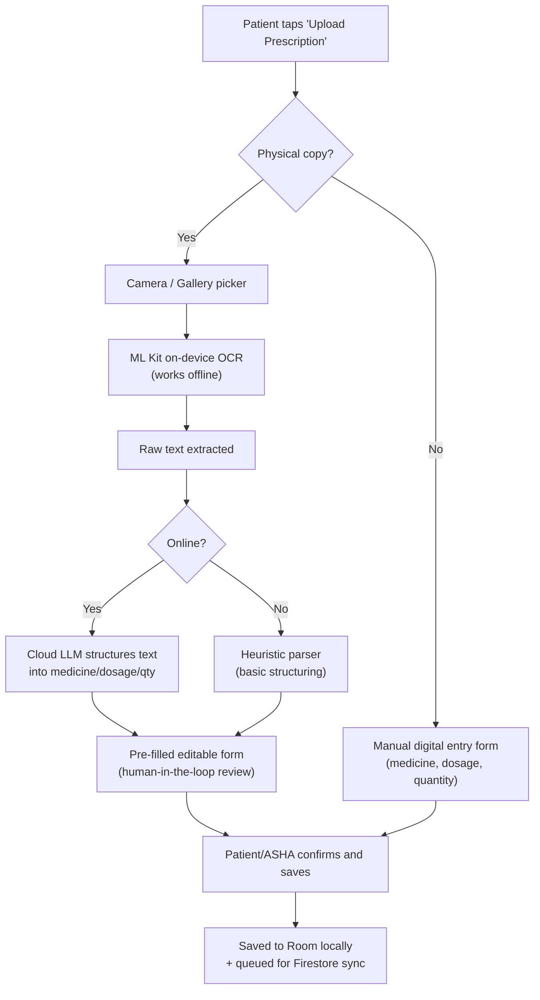
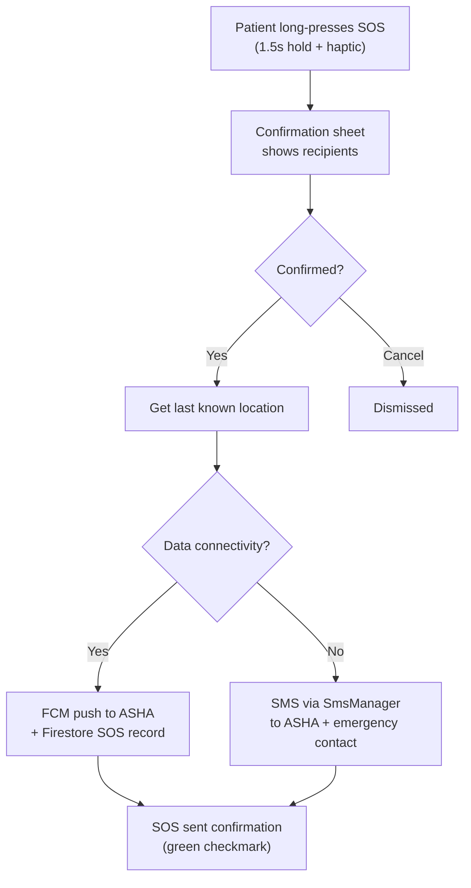
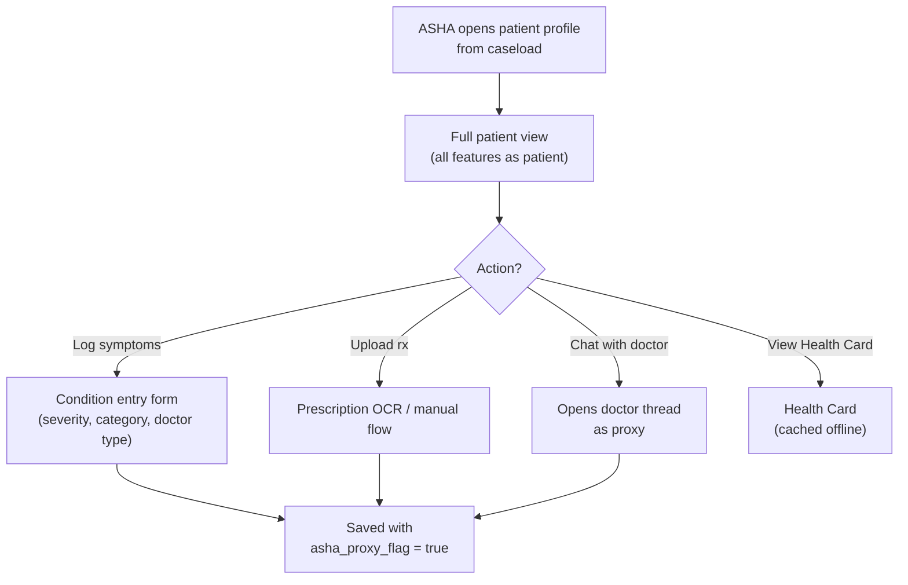
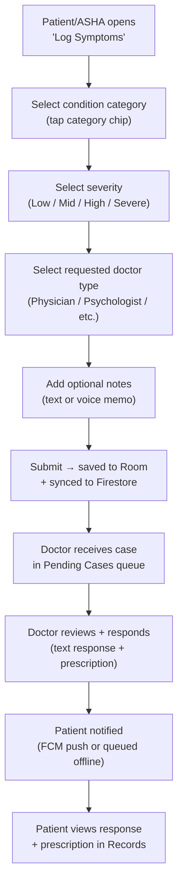

# VitalSense — Design Document

**Platform:** Android (Native, Jetpack Compose)
**Document status:** Draft v1.0
**Last updated:** 2026-08-14
**Source documents:** [prd.md](file:///C:/Users/saras/OneDrive/Documents/sehatSetu/prd.md) · [tech-stack.md](file:///C:/Users/saras/OneDrive/Documents/sehatSetu/tech-stack.md)

---

## 1. Design Philosophy

VitalSense serves rural Indian users — ASHA workers, patients with low digital literacy, overworked doctors, and district admins — inside a **single Android application**. The design must feel **friendly, approachable, and lifestyle-oriented** rather than clinical or intimidating.

### 1.1 Core Design Principles

| Principle | What it means in practice |
|---|---|
| **AI as a helpful companion, not a tech product** | Present features like OCR prescription scanning and mental health check-ins as simple, conversational actions — not "AI tools." The interface should make it easy for users to understand what they can do, explore ready-made prompts, and act naturally. |
| **Icon-first, text-lite** | Every patient-facing screen prioritizes large icons, visual cues, and minimal reading. Labels are short, instructional text is dismissible, and actions are 1–2 taps away. |
| **Bright, warm, non-clinical** | Move away from hospital-blue and sterile white. Use a **warm, lifestyle-forward palette** with soft pastels and a bold accent that feels human, not medical. |
| **Offline is normal, not degraded** | Offline states are not error screens. They are first-class experiences with clear, friendly indicators of what's cached, what's pending, and what will sync. |
| **One app, four homes** | Role-based dashboards share a consistent design language but each role gets a home screen tailored to its primary tasks — no one sees features irrelevant to them. |

---

## 2. Visual Identity & Branding

### 2.1 Typography

| Use | Font | Weight | Size (sp) | Notes |
|---|---|---|---|---|
| Display / Hero headings | **Poppins** | Bold (700) | 28–32 | Used for welcome greetings ("Hey, Alex"), section headers, and the Health Card headline. |
| Section titles | **Poppins** | SemiBold (600) | 20–24 | Category labels, dashboard section heads. |
| Body text | **Poppins** | Regular (400) | 14–16 | Descriptions, instructions, chat messages. |
| Captions & metadata | **Poppins** | Regular (400) | 12 | Timestamps, secondary labels, help text. |
| Buttons & CTAs | **Poppins** | Medium (500) | 14–16 | All interactive text. |

> **Why Poppins:** Geometric, rounded, highly legible at small sizes on low-DPI screens common in rural Android devices. Excellent support for Devanagari and other Indian scripts via Google Fonts, directly supporting the localization requirement.

### 2.2 Color Palette

The palette is inspired by the reference designs — **bright, colorful category blocks** with a **dominant neon-lime accent** on a warm, cream base. This moves the product away from the usual sci-fi/clinical look and makes it feel **friendly, practical, and lifestyle-oriented**.

| Token | Hex | Role |
|---|---|---|
| **Lime / Primary Accent** | `#E8EB7D` | Primary action buttons, CTA fills, active states, SOS highlight ring, Health Card accent |
| **Lavender** | `#A3AEFE` | Secondary actions, selected category chips (e.g., "Mental Health"), doctor card accents |
| **Charcoal** | `#B0B472` | Dark UI elements, text on light backgrounds, icon fills, navigation bar |
| **Blush Pink** | `#FFB8F0` | Tertiary accent — mood check-in, mental health section, gentle alert states |
| **Warm Cream (Background)** | `#FFF8ED` | App-wide background, card surfaces — never pure white |
| **Soft Mint** | `#C8F5D4` | Success states, sync-complete indicators, "healthy" severity badge |
| **Coral / Alert** | `#FF6B6B` | SOS button, severe-severity badge, destructive actions, error states |
| **Amber / Warning** | `#FFD166` | Mid/high severity badges, pending-sync indicators |
| **Near-Black (Text)** | `#1A1A1A` | Primary text color |
| **Muted Grey (Text)** | `#7A7A7A` | Secondary/caption text |

### 2.3 Category Color-Coding

Each topic/category that patients interact with gets its own **bright, distinct chip color** — making navigation icon-first and literacy-independent:

| Category | Chip Color | Icon |
|---|---|---|
| General Medicine | `#E8EB7D` (Lime) | 💊 |
| Nutrition / Diet | `#FFB8F0` (Pink) | 🍳 |
| Fitness / Physical | `#C8F5D4` (Mint) | 🏃 |
| Mental Health | `#A3AEFE` (Lavender) | 🧠 |
| Maternal Health | `#FFD166` (Amber) | 🤱 |
| Emergency | `#FF6B6B` (Coral) | 🚨 |

### 2.4 Iconography

- **Style:** Rounded, filled icons with soft corners — matching Poppins' geometric warmth.
- **Size:** Minimum 48dp touch targets (accessible), icon visual size 24–32dp.
- **Library:** Material Symbols (Rounded, Filled variant) as the base set; custom illustrated icons for key patient-facing features (Health Card, SOS, Mental Health) to add personality.
- **Category tiles:** Use **real photographs** inside rounded-rectangle cards with a semi-transparent color overlay matching the category chip color — as shown in the reference designs (Tourism with a travel photo, Cooking with a chef photo, etc.).

### 2.5 Elevation, Depth & Surfaces

| Surface | Treatment |
|---|---|
| **Background** | Warm cream `#FFF8ED` — never pure white |
| **Cards** | 2dp elevation, 16dp corner radius, `#FFFFFF` fill with subtle warm shadow (`rgba(0,0,0,0.06)`) |
| **Floating action areas** | 4dp elevation, pill-shaped, primary accent fill |
| **Bottom navigation** | 0dp elevation, translucent cream background with top hairline border |
| **Modals / Bottom sheets** | 8dp elevation, 24dp top corner radius, cream background |

### 2.6 Corner Radii

| Element | Radius |
|---|---|
| Cards (standard) | 16dp |
| Category chips | Full pill (height / 2) |
| Buttons (primary) | Full pill |
| Input fields | 12dp |
| Bottom sheets | 24dp (top only) |
| Avatar / profile images | Full circle |
| Photo cards (category tiles) | 16dp |

---

## 3. Layout & Grid System

### 3.1 Screen Grid

- **Margins:** 16dp horizontal padding on all screens.
- **Gutter:** 12dp between grid items.
- **Content width:** Full-bleed on mobile; content maxes out at screen width minus margins.
- **Columns:** 2-column grid for category tiles and card grids; single column for chat, forms, and detail views.

### 3.2 Spacing Scale (dp)

| Token | Value | Usage |
|---|---|---|
| `xs` | 4 | Inline icon-to-text gap |
| `sm` | 8 | Compact list item padding, chip internal padding |
| `md` | 12 | Card internal padding, gutter between grid items |
| `lg` | 16 | Screen margins, section spacing |
| `xl` | 24 | Major section breaks, top-of-screen greeting to content |
| `2xl` | 32 | Hero area spacing, between dashboard sections |
| `3xl` | 48 | Screen top safe area to first content |

---

## 4. Screen Architecture by Role

### 4.1 Patient Dashboard (Primary Focus)

The patient home screen is the most critical — designed for **low-literacy, icon-heavy, 2-tap access** to core features.

```
┌─────────────────────────────────────┐
│  9:41          ▲ 8 tokens left      │  ← Status bar + token/usage badge
│                                     │
│  Hey, [Name]                        │  ← Personalized greeting (Poppins Bold 28sp)
│  What is the plan for today?        │  ← Subtitle (Poppins Regular 16sp, grey)
│                                     │
│  ┌─────────────────────────────┐    │
│  │ Design your perfect daily   │    │  ← Hero card (Lime accent background)
│  │ routine with elite          │    │     with contextual health tip
│  │                             │    │
│  │  [ Unlock now ]             │    │  ← Primary CTA button (dark pill)
│  └─────────────────────────────┘    │
│                                     │
│  How can I help you today?          │  ← Section header
│                                     │
│  ┌──────┐  ┌──────┐                 │  ← 2-column category grid
│  │📷    │  │🍳    │                 │     with REAL photo backgrounds
│  │Health │  │Nutri-│                 │     + category label chip
│  │Card   │  │tion  │                 │
│  └──────┘  └──────┘                 │
│  ┌──────┐  ┌──────┐                 │
│  │🧠    │  │🎨    │                 │
│  │Mental │  │Govt  │                 │
│  │Health │  │Schemes│               │
│  └──────┘  └──────┘                 │
│                                     │
│  ┌─────────────────────────────┐    │
│  │  🚨 EMERGENCY SOS           │    │  ← Persistent SOS strip (Coral)
│  └─────────────────────────────┘    │
│                                     │
│  ━━━━━━━━━━━━━━━━━━━━━━━━━━━━━━━   │
│  🏠   💬   📋   👤                 │  ← Bottom nav: Home, Chat, Records, Profile
└─────────────────────────────────────┘
```

**Key design decisions:**
- **Hero card** rotates between a health tip, a pending appointment reminder, or a sync-status summary — context-aware and warm in tone.
- **Category tiles** use real imagery (not abstract icons) with a semi-transparent colored overlay and a small label chip, matching the reference design's "How can I help you today?" grid.
- **SOS strip** is always visible, high-contrast coral, and responds to a single long-press (preventing accidental triggers).
- **Token badge** (top right) maps to the user's remaining AI-assisted interactions (OCR scans, etc.) — shown subtly, not blocking.

### 4.2 Chat / Conversation Screen

Follows a conversational AI pattern — the user asks in natural language (or taps a suggested prompt), and receives structured responses.

```
┌─────────────────────────────────────┐
│  ←  Cardio workout for beginner  ⋯  │  ← Back + topic title + overflow
│                                     │
│  ┌─────────────────────────┐        │
│  │ Hi! Can you help me     │  USER  │  ← User message bubble (cream)
│  │ create a workout plan?  │        │
│  └─────────────────────────┘        │
│                                     │
│  ┌─────────────────────────┐        │
│  │ Of course! What is your │  APP   │  ← App response (lime tint)
│  │ fitness level?          │        │
│  └─────────────────────────┘        │
│                                     │
│  ┌─────────────────────────┐        │
│  │ I need cardio, I am a   │  USER  │
│  │ beginner.               │        │
│  └─────────────────────────┘        │
│                                     │
│  ┌─────────────────────────┐        │
│  │ ┌───────────────────┐   │  APP   │  ← Rich media response
│  │ │  ▶ Video preview   │   │        │     (embedded video card)
│  │ └───────────────────┘   │        │
│  │                         │        │
│  │ Warm-up (5 mins)        │        │  ← Structured workout plan
│  │ Light jogging or jump…  │        │
│  └─────────────────────────┘        │
│                                     │
│  ━━━━━━━━━━━━━━━━━━━━━━━━━━━━━━━   │
│  [ 💬 Message... ]    +12    ➤     │  ← Input + token count + send
└─────────────────────────────────────┘
```

> In VitalSense, this pattern applies to:
> - **Patient ↔ Doctor** consultations (doctor responds with prescriptions, advice)
> - **Patient ↔ ASHA Worker** chat (instructions, follow-ups)
> - **AI OCR flow** (user uploads image → app shows extracted text → user confirms)

### 4.3 ASHA Worker Dashboard

```
┌─────────────────────────────────────┐
│  Hey, [ASHA Name]                   │
│  You have 3 patients needing action │
│                                     │
│  ┌─ Active Alerts ────────────────┐ │
│  │ 🔴 Ramesh K. — Severe fever    │ │  ← Priority-sorted patient list
│  │ 🟡 Priya D. — Pending sync     │ │     with severity color badges
│  │ 🟢 Anita S. — Stable           │ │
│  └────────────────────────────────┘ │
│                                     │
│  ┌──────┐  ┌──────┐  ┌──────┐      │
│  │ + New │  │ 📋   │  │ 📢   │     │  ← Quick actions row
│  │Patient│  │Cases │  │Notice│      │
│  └──────┘  └──────┘  └──────┘      │
│                                     │
│  ┌─ Recent Activity ──────────────┐ │
│  │ …                              │ │
│  └────────────────────────────────┘ │
└─────────────────────────────────────┘
```

### 4.4 Doctor Dashboard

```
┌─────────────────────────────────────┐
│  Dr. [Name] — Physician             │
│  4 pending cases · 2 appointments   │
│                                     │
│  ┌─ Pending Cases ────────────────┐ │
│  │ Patient name · Category · Sev. │ │  ← Sortable case queue
│  │ [Respond]  [View History]      │ │
│  └────────────────────────────────┘ │
│                                     │
│  ┌─ Today's Appointments ─────────┐ │
│  │ 10:30 AM — Ramesh K. (follow-up)│ │
│  │ 2:00 PM  — Anita S. (new)      │ │
│  └────────────────────────────────┘ │
│                                     │
│  ┌─ Recent Prescriptions ─────────┐ │
│  │ …                              │ │
│  └────────────────────────────────┘ │
└─────────────────────────────────────┘
```

### 4.5 Admin Dashboard

```
┌─────────────────────────────────────┐
│  VitalSense Admin                   │
│  Region: [District Name]           │
│                                     │
│  ┌─ Heat Map ─────────────────────┐ │
│  │  [Interactive choropleth map]  │ │  ← Color-coded village overlay
│  │  Filters: Category | Severity  │ │     on Google Maps
│  │           | Date Range         │ │
│  └────────────────────────────────┘ │
│                                     │
│  ┌──────┐  ┌──────┐  ┌──────┐      │
│  │ 📢   │  │ 🏘️   │  │ 👥   │     │
│  │Broad-│  │Villa-│  │Staff │      │
│  │cast  │  │ges   │  │Review│      │
│  └──────┘  └──────┘  └──────┘      │
│                                     │
│  ┌─ System Summary ───────────────┐ │
│  │ Patients: 1,240  |  Active: 89 │ │
│  │ ASHA: 24  |  Doctors: 8        │ │
│  └────────────────────────────────┘ │
└─────────────────────────────────────┘
```

---

## 5. Component Library

### 5.1 Category Tile (Patient Home)

```
┌──────────────────────┐
│                      │
│  [Photo background]  │    160dp × 120dp
│                      │    16dp corner radius
│  ┌────────────┐      │    Photo with 40% colored overlay
│  │ 🍳 Cooking │      │    Category chip (bottom-left, pill-shaped)
│  └────────────┘      │    matching category color
└──────────────────────┘
```

- **Photo:** Real, relatable imagery (not stock — ideally Indian context for rural users).
- **Overlay:** Semi-transparent category color at 40% opacity.
- **Chip:** Pill-shaped, fully opaque category color, white or dark text depending on contrast.
- **Tap target:** Entire card, minimum 48dp height.

### 5.2 Health Card

```
┌──────────────────────────────────────┐
│  ♥ HEALTH CARD                       │
│  ━━━━━━━━━━━━━━━━━━━━━━━━━━━━━━━━━  │
│                                      │
│  [Photo]  Ramesh Kumar               │
│           Village: Sundarpura        │
│           Age: 42 · Male             │
│           ASHA: Priya Devi           │
│                                      │
│  ┌──────────────────────────────┐    │
│  │  Current Risk: ██ MODERATE  │    │  ← Amber badge for mid severity
│  └──────────────────────────────┘    │
│                                      │
│  Last condition: Chronic cough       │
│  Last visit: 2026-08-10             │
│  Next appointment: 2026-08-18       │
│                                      │
│  Generated: 2026-08-14 · Offline ✓  │
└──────────────────────────────────────┘
```

- **Always accessible**, even offline (cached in Room).
- **Risk badge** color-coded: Mint (low), Amber (mid), Coral (high/severe).
- **Shareable** as an image or PDF.

### 5.3 SOS Button

```
┌──────────────────────────────────────┐
│  🚨  EMERGENCY SOS                   │
│      Long-press to activate          │
└──────────────────────────────────────┘
```

- **Always visible** on patient dashboard — coral background, white text.
- **Long-press activation** (1.5s hold) with haptic feedback and a filling animation to prevent accidental triggers.
- **Confirmation sheet** slides up showing: "Sending alert to [ASHA Name] and [Emergency Contact] with your location."
- Works via **SMS fallback** — no internet required.

### 5.4 Severity Badge

| Severity | Color | Visual |
|---|---|---|
| Low | `#C8F5D4` (Mint) | `●` Low |
| Mid | `#FFD166` (Amber) | `●` Moderate |
| High | `#FF9F43` (Orange) | `●` High |
| Severe | `#FF6B6B` (Coral) | `●` Severe |

Pill-shaped, 8dp vertical padding, 16dp horizontal padding, Poppins Medium 12sp.

### 5.5 Chat Bubbles

| Sender | Background | Text | Alignment |
|---|---|---|---|
| User (Patient) | `#F0EDE6` (warm grey) | `#1A1A1A` | Right |
| App / Doctor / ASHA | `#F0F5D4` (light lime) | `#1A1A1A` | Left |
| System notice | `#FFF8ED` with dashed border | `#7A7A7A` | Center |

- Max width: 80% of screen width.
- Corner radius: 16dp, with the sender's corner squared off (bottom-right for user, bottom-left for responder).
- Rich content (images, videos, structured data) embedded inline within bubbles.

### 5.6 Prompt Suggestion Chips

Horizontally scrollable row of pill-shaped suggestion chips above the chat input:

```
[ Log new symptoms ] [ Show my prescriptions ] [ Talk to my doctor ] [ Mental health check-in ]
```

- Background: White with 1dp border matching category color.
- On tap: auto-fills the chat input.

### 5.7 Inline Help Tooltip

```
┌─ ℹ️ ──────────────────────────────┐
│  This page shows your health      │
│  history and current risk level.  │
│  Tap any entry to see details.    │
│                          [Got it] │
└───────────────────────────────────┘
```

- Shown **once per page** on first open (state persisted locally in Room).
- Dismissible via "Got it" button.
- Re-accessible via the `ℹ️` icon in the top app bar.
- Translatable per locale.

---

## 6. Key User Flows

### 6.1 Patient First-Time Registration



### 6.2 Prescription OCR Flow



### 6.3 SOS Emergency Flow



### 6.4 ASHA Proxy Action Flow



### 6.5 Condition Entry & Doctor Response Flow



---

## 7. Offline & Sync UX

### 7.1 Sync Status Indicators

| State | Visual | Location |
|---|---|---|
| **Online and synced** | `●` Mint dot + "All synced" | Profile/settings header |
| **Online, syncing** | `↻` Spinning amber icon + "Syncing…" | Top app bar, subtle |
| **Offline, cached data available** | `☁️✕` Grey cloud-slash + "Offline — showing cached data" | Inline banner below app bar |
| **Offline, pending uploads** | `↑ 3 pending` Amber badge | Bottom nav, on Records tab icon |
| **Conflict detected** | `⚠️` Orange triangle on the conflicting field | Inline on the specific record |

### 7.2 Offline Capabilities Matrix

| Feature | Offline behavior |
|---|---|
| View Health Card | ✅ Fully cached, instant render |
| View previously opened prescriptions/reports | ✅ Cached in Room + local file storage |
| Log new symptoms | ✅ Saved locally, queued (outbox pattern) |
| Upload prescription photo | ✅ Photo saved locally, OCR runs on-device, sync queued |
| Chat (send message) | ✅ Queued locally, sent on reconnect |
| Chat (read history) | ✅ Cached messages visible |
| View map (doctors/hospitals) | ⚠️ Shows last-fetched data, read-only |
| Schedule appointment | ⚠️ Request queued, not confirmed until sync |
| SOS | ✅ Falls back to native SMS (no data required) |
| Admin heat map | ❌ Requires network for fresh aggregated data |

---

## 8. Accessibility & Localization

### 8.1 Accessibility Requirements

| Requirement | Implementation |
|---|---|
| **Minimum touch target** | 48dp × 48dp for all interactive elements |
| **Text scaling** | Support Android system font scaling up to 200% without layout breakage |
| **Color contrast** | WCAG AA minimum (4.5:1 for body text, 3:1 for large text) against all background surfaces |
| **Content descriptions** | All icons and images have `contentDescription` for TalkBack; decorative images marked `null` |
| **Focus order** | Logical tab/focus order matching visual layout for switch access users |
| **Reduced motion** | Respect `prefers-reduced-motion` system setting — disable micro-animations |

### 8.2 Localization Strategy

- **In-app language switcher** — not tied to device locale.
- All patient-facing strings in `res/values-<lang>/strings.xml`.
- **Priority languages (to be confirmed):** Hindi, Marathi, Tamil, Telugu, Kannada, Bengali, Gujarati, English.
- Instructional help content stored in Firestore collection keyed by language code — editable without app release.
- OCR output from prescriptions in a different language than the user's selected locale triggers a **translation prompt** before saving.
- **RTL support**: Not required for Indian languages (all LTR), but layout should not hard-code directionality.

---

## 9. Motion & Micro-interactions

### 9.1 Transitions

| Transition | Type | Duration | Easing |
|---|---|---|---|
| Screen-to-screen (forward) | Shared axis (X) | 300ms | FastOutSlowIn |
| Screen-to-screen (back) | Shared axis (X, reverse) | 250ms | FastOutSlowIn |
| Bottom sheet appear | Slide up + fade | 250ms | DecelerateEasing |
| Bottom sheet dismiss | Slide down + fade | 200ms | AccelerateEasing |
| Card expand (detail view) | Container transform | 350ms | FastOutSlowIn |
| Toast / Snackbar | Fade in + slide up | 200ms | DecelerateEasing |

### 9.2 Micro-interactions

| Element | Interaction | Animation |
|---|---|---|
| **SOS button** | Long-press hold | Radial fill animation (coral ring fills over 1.5s), haptic pulse at 0.5s and 1.0s |
| **Category tile** | Tap | Scale down to 0.96 (60ms) → scale back to 1.0 (120ms) + subtle shadow increase |
| **Severity badge** | On appearance | Fade in + gentle scale from 0.8 to 1.0 (200ms) |
| **Sync indicator** | Syncing state | Continuous slow rotation (1.2s per revolution) |
| **Chat bubble** | New message | Slide in from bottom + fade (150ms, staggered 30ms per bubble in batch) |
| **Token count** | On change | Number morph animation (count up/down, 300ms) |
| **Health Card risk level** | On change | Color crossfade (400ms) between old and new severity color |

---

## 10. Technical Design Mapping

### 10.1 Architecture → Design Alignment

| Design System Element | Technical Implementation |
|---|---|
| **Color palette tokens** | Compose `MaterialTheme.colorScheme` custom extension with VitalSense-specific tokens |
| **Typography scale** | Custom `Typography` object with Poppins at defined weights/sizes |
| **Spacing scale** | Compose extension properties on `Dp` (e.g., `Spacing.lg = 16.dp`) |
| **Corner radii** | `RoundedCornerShape` tokens in theme |
| **Dark theme** | Not prioritized for MVP — rural outdoor usage favors light/high-contrast themes |
| **Offline indicators** | `ConnectivityManager` + `NetworkCallback` → `StateFlow<ConnectivityState>` observed by top-level scaffold |
| **Role-based navigation** | `NavHost` with nested graphs per role, selected at login via Firebase custom claims |
| **Category tiles** | `@Composable CategoryTileGrid` — `LazyVerticalGrid(columns = 2)` with `AsyncImage` (Coil) for photos |
| **Chat UI** | `LazyColumn` with `ChatBubble` composable, message data from Room DAO → Flow |
| **Health Card** | Single `@Composable HealthCard` rendered from `HealthCardUiState` (cached in Room, never needs network) |
| **SOS** | `LongPressGesture` detector → `SmsManager` or FCM, modeled as a dedicated `SosViewModel` |
| **Localization** | `strings.xml` per locale + `LocalConfiguration` with in-app override via `AppCompatDelegate.setApplicationLocales()` |

### 10.2 Module → Screen Mapping

```
feature/
├── auth/           → Login Screen, Language Selector, Registration
├── admin/          → Admin Dashboard, Heat Map, Village Manager, Staff Review, Broadcast
├── asha/           → ASHA Dashboard, Caseload List, Patient Proxy View, Notices
├── doctor/         → Doctor Dashboard, Case Queue, Prescription Writer, Appointment Manager
├── patient/
│   ├── healthcard/      → Health Card Screen
│   ├── conditionentry/  → Symptom Entry Form
│   ├── prescriptions/   → Prescription List, OCR Flow, Manual Entry Form
│   ├── appointments/    → Appointment Scheduler
│   ├── map/             → Nearby Doctors/Hospitals Map
│   ├── schemes/         → Government Schemes Browser
│   ├── mentalhealth/    → Mood Check-in, Breathing Exercise, Referral Flow
│   ├── sos/             → SOS Trigger + Confirmation Sheet
│   └── help/            → Inline Help System + Full Manual
└── chat/           → Shared Chat Screen (Patient↔ASHA, Patient↔Doctor)
```

### 10.3 Compose Theme Structure

```kotlin
// Theme.kt
@Composable
fun VitalSenseTheme(content: @Composable () -> Unit) {
    val colors = lightColorScheme(
        primary = Color(0xFFE8EB7D),        // Lime
        secondary = Color(0xFFA3AEFE),       // Lavender
        tertiary = Color(0xFFFFB8F0),        // Blush Pink
        background = Color(0xFFFFF8ED),      // Warm Cream
        surface = Color(0xFFFFFFFF),
        error = Color(0xFFFF6B6B),           // Coral
        onPrimary = Color(0xFF1A1A1A),
        onBackground = Color(0xFF1A1A1A),
        onSurface = Color(0xFF1A1A1A),
    )

    val typography = Typography(
        displayLarge = TextStyle(
            fontFamily = Poppins,
            fontWeight = FontWeight.Bold,
            fontSize = 32.sp
        ),
        headlineMedium = TextStyle(
            fontFamily = Poppins,
            fontWeight = FontWeight.SemiBold,
            fontSize = 22.sp
        ),
        bodyLarge = TextStyle(
            fontFamily = Poppins,
            fontWeight = FontWeight.Normal,
            fontSize = 16.sp
        ),
        // ... full scale
    )

    MaterialTheme(
        colorScheme = colors,
        typography = typography,
        shapes = VitalSenseShapes,
        content = content
    )
}
```

---

## 11. Design Tokens Summary

### Quick Reference

| Token | Value |
|---|---|
| `color.primary` | `#E8EB7D` |
| `color.secondary` | `#A3AEFE` |
| `color.tertiary` | `#FFB8F0` |
| `color.background` | `#FFF8ED` |
| `color.surface` | `#FFFFFF` |
| `color.error` | `#FF6B6B` |
| `color.success` | `#C8F5D4` |
| `color.warning` | `#FFD166` |
| `color.textPrimary` | `#1A1A1A` |
| `color.textSecondary` | `#7A7A7A` |
| `font.family` | Poppins |
| `font.display` | Bold 32sp |
| `font.headline` | SemiBold 22sp |
| `font.body` | Regular 16sp |
| `font.caption` | Regular 12sp |
| `radius.card` | 16dp |
| `radius.chip` | pill |
| `radius.button` | pill |
| `radius.input` | 12dp |
| `radius.sheet` | 24dp |
| `spacing.margin` | 16dp |
| `spacing.gutter` | 12dp |
| `elevation.card` | 2dp |
| `elevation.fab` | 4dp |
| `elevation.modal` | 8dp |
| `touch.minTarget` | 48dp × 48dp |

---

## 12. Open Design Questions

> [!IMPORTANT]
> The following decisions should be resolved before moving to high-fidelity prototyping:

1. **Category taxonomy:** What are the exact health condition categories for the patient home grid? (The PRD mentions condition "category type" but doesn't enumerate them.)
2. **Dark mode:** Should a dark theme be supported at MVP? (Current recommendation: no — outdoor/sunlight usage in rural areas favors high-contrast light themes.)
3. **Photo sources for category tiles:** Will the team commission/source contextual Indian photography, or use illustrated icons as a fallback?
4. **Token/credit system:** The reference designs show a "tokens left" badge — does VitalSense have a usage-limit concept for AI features (OCR scans), or is this unlimited at prototype?
5. **Onboarding illustrations:** Should the first-time flow include illustrated walkthrough screens (recommended for low-literacy users), and if so, what style?
6. **ASHA Worker branding:** Should the ASHA dashboard feel visually distinct (e.g., a different accent color) from the patient view, or share the same palette?

---

## 13. Appendix: Reference Design Mapping

The reference images (Ronas IT / UI/UX Team — Dribbble) informed the following design decisions:

| Reference Element | VitalSense Application |
|---|---|
| "How can I help you today?" category grid with photo cards | Patient dashboard home — category tile grid with health categories |
| Poppins typography throughout | Adopted as the primary typeface across all roles |
| Color palette (`#E8EB7D`, `#A3AEFE`, `#B0B472`, `#FFB8F0`) | Mapped to primary, secondary, charcoal, and tertiary tokens |
| Conversational AI chat interface with rich responses | Doctor/ASHA chat and OCR review flow |
| "Hey, Alex" personalized greeting + hero card | "Hey, [Patient Name]" with rotating health tip hero card |
| Warm cream background (not pure white) | App-wide background token `#FFF8ED` |
| Bright category chips (Tourism, Cooking, Sport, Art) | Health category chips (General, Mental Health, Maternal, Emergency, etc.) |
| Token count badge | AI feature usage indicator (if applicable) |
| "Unlock now" CTA button (dark pill on lime) | Primary action button style across the app |
