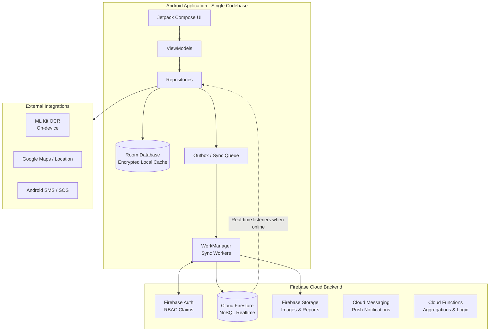

# VitalSense — System Design Document

> **Project Goal:** To provide a comprehensive system design overview that highlights the architecture, feasibility, and technical depth of the VitalSense platform.

## 1. Problem Statement
Rural healthcare faces severe challenges: lack of internet connectivity, low digital literacy among patients, delayed disease trend detection, and a disconnect between local health workers (ASHAs) and specialized doctors.

## 2. The VitalSense Solution
**VitalSense** is a unified, **offline-first Android application** that bridges rural patients, community health (ASHA) workers, doctors, and health administrators in a single connected ecosystem.

### Key Features & Novelty
- **Offline-First Resilience:** Room DB outbox pattern and WorkManager background sync ensure critical features work with zero internet connectivity.
- **4-in-1 Role Architecture:** Dedicated, permission-aware workflows for Admins, ASHA Workers, Doctors, and Patients within a single codebase.
- **ASHA Proxy Care:** Enables community health workers to record symptoms, book appointments, and upload records on behalf of low-literacy patients.
- **AI Prescription Digitization:** On-device ML Kit OCR to extract, review, and digitize physical prescriptions without needing network access.
- **Early Outbreak Trend Heat Maps:** Aggregated symptom tracking for health administrators to spot emerging village-level health clusters.
- **Emergency SOS:** High-priority alerts with GPS location that fall back to cellular SMS when mobile data is unavailable.

---

## 3. High-Level Architecture

The architecture relies on an **Offline-First MVVM** approach. Network access is treated as a synchronization opportunity rather than a prerequisite for ordinary reads.

---

## 4. Technology Stack

| Layer | Technology | Justification |
|---|---|---|
| **Language** | Kotlin | Modern, concise, and safe standard for Android development. |
| **UI Toolkit** | Jetpack Compose | Declarative UI for building role-specific dashboards efficiently and maintaining a single source of truth for the design system. |
| **Architecture** | MVVM + Repository | Clean separation of concerns, testability, and adherence to official Android architecture guidelines. |
| **Dependency Injection** | Hilt | Simplifies component lifecycles and testing across multiple distinct user roles. |
| **Local Database** | Room (SQLite) | Crucial for the offline-first requirement; caches required patient data locally. |
| **Background Sync** | WorkManager | Guarantees reliable delivery of queued actions (outbox pattern) when network connectivity is restored. |
| **Backend & Real-time** | Firebase (Firestore, Auth) | Facilitates rapid development, provides built-in offline caching, and real-time data synchronization. |
| **AI / ML** | ML Kit Text Recognition | On-device OCR allows for prescription digitization even in the absence of internet connectivity. |
| **Location & Maps** | Google Maps SDK | Enables nearest hospital mapping and SOS location sharing functionalities. |

---

## 5. Security & Privacy Considerations

For healthcare applications, data privacy is paramount. The following measures are implemented:
- **Role-Based Access Control (RBAC):** Firebase Auth custom claims (`admin`, `asha`, `doctor`, `patient`) ensure users only access their authorized application routes.
- **Firestore Security Rules:** Server-side enforcement of data access. A patient can only read their data; doctors can only read assigned patients; ASHAs only their assigned caseload.
- **Data at Rest:** Local Room database is protected against unauthorized access.
- **Consent-Driven Proxy:** ASHA workers can only access a patient's data if the patient explicitly adds their unique ASHA ID as a helper.

---

## 6. Core Use Cases & User Flow

### A. Patient Flow (Low Literacy / Offline)
1. Patient logs in (or registers via ASHA).
2. Patient views their **Health Card** (cached locally).
3. Patient experiences symptoms -> Logs them via simple, icon-heavy UI.
4. If offline, the symptom log is stored in the Room DB Outbox.
5. When online, WorkManager syncs data to Firestore.

### B. ASHA Proxy Flow
1. ASHA worker logs in and views their assigned Village Caseload.
2. Selects a patient requiring assistance.
3. Captures an image of the patient's physical prescription.
4. **ML Kit OCR** reads the text on-device. ASHA reviews, edits if necessary, and saves.
5. Data is synced to the patient's digital record.

### C. Doctor Flow
1. Doctor receives a case review request.
2. Views digitized prescriptions and AI-extracted symptom history.
3. Replies with a medical response and establishes an appointment schedule.

### D. Admin Flow (Trend Detection)
1. Admin logs in and views the **Dashboard Heatmap**.
2. Cloud Functions aggregate recent symptom reports.
3. Heatmap displays symptom density (e.g., a spike in fever in a specific village), enabling early intervention and resource allocation.

---

## 7. Future Scalability
- **Dispensary Integration:** Linking the application to real-time government dispensary stock APIs.
- **EHR Interoperability:** Adopting FHIR standards to synchronize patient records with state/national healthcare databases.
- **Advanced LLM Processing:** Integrating a secure cloud LLM to structure complex, handwritten medical notes from the OCR output.
