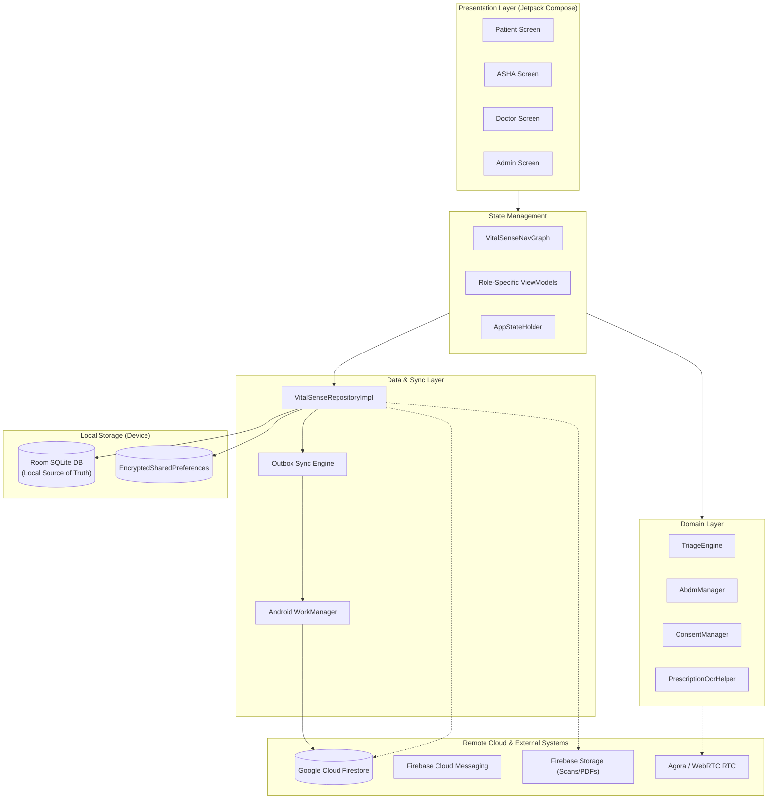
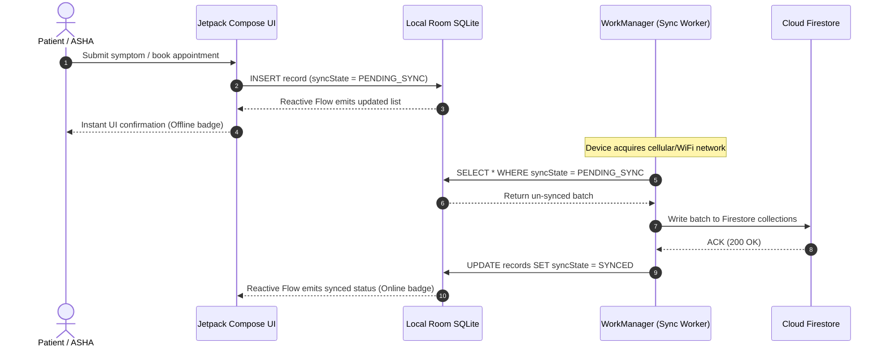
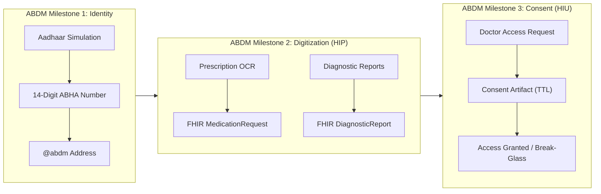

# 🏛️ VitalSense (SehatSetu) — System Design Document

**Project:** Rural Health Bridge (SIH 26133)  
**Architecture:** Offline-First, Clean Architecture, Distributed Mobile-Cloud Sync  

---

## 1. High-Level Architecture Overview

VitalSense employs an **Offline-First Clean Architecture** where the Android local database (Room SQLite) acts as the **single source of truth** for the UI. Remote synchronization with Google Cloud Firestore and ABDM services occurs asynchronously via an Outbox Pattern managed by WorkManager.



---

## 2. Offline-First Synchronization & Outbox Engine

### 2.1 The Outbox Pattern Workflow
1. **Local Mutation:** When an ASHA or Patient logs a symptom or books a token offline, the record is immediately committed to Room SQLite with a `syncState` column set to `PENDING_SYNC` and a millisecond timestamp.
2. **UI Immediate Update:** The UI observes Room DAOs via Kotlin `Flow`, updating instantaneously without waiting for network ACK.
3. **Background Sync Worker (`SyncDataWorker.kt`):**
   - Registered with Android WorkManager using `NetworkType.CONNECTED` constraint.
   - When the device connects to WiFi or cellular data, `SyncDataWorker` wakes up in the background.
   - It queries all tables for `syncState == PENDING_SYNC`, transforms them into batch payloads, and writes them to Cloud Firestore.
   - Upon Firestore success, the local Room records are updated to `syncState = SYNCED`.



### 2.2 Conflict Resolution Strategy
- **Deterministic Timestamp-Based Last-Write-Wins (LWW):** Every record contains an updated `timestamp: Long`. In multi-writer scenarios, the newer timestamp takes precedence.
- **Clinical Priority Safeguard:** If a clinical record has `triageLevel == CRITICAL` or `priorityFlag == true`, it is never overwritten by a lower-priority state during merges; conflict resolution flags the record for Medical Officer manual audit.

---

## 3. Database Schema & Data Modeling

### 3.1 Core Local Room SQLite Entities
VitalSense defines relational entities managed by `VitalSenseDatabase` (`Entities.kt`):

| Entity Name | Primary Key | Key Attributes | Purpose |
| :--- | :--- | :--- | :--- |
| **`PatientEntity`** | `id: String` | `name`, `age`, `gender`, `villageId`, `abhaId`, `emergencyContact`, `riskLevel` | Patient demographic profile & ABHA identity |
| **`ConditionRecordEntity`** | `id: String` | `patientId`, `symptoms`, `heartRate`, `spO2`, `bloodPressure`, `severity`, `timestamp` | Biometric telemetry & clinical observations |
| **`PrescriptionEntity`** | `id: String` | `patientId`, `doctorId`, `medicinesJson`, `instructions`, `date`, `isDigitized` | Structured medication records & digitized OCR prescriptions |
| **`OpdTokenEntity`** | `id: String` | `tokenNumber`, `department`, `patientId`, `status`, `estimatedWaitMinutes` | Live clinic queue token tracking |
| **`IpdBedEntity`** | `id: String` | `wardType` (General/ICU/O2), `bedNumber`, `isOccupied`, `patientId` | In-patient ward capacity monitoring |
| **`OtSurgeryBookingEntity`**| `id: String`| `patientName`, `procedureName`, `surgeonName`, `otRoomNumber`, `pacStatus` | Surgical theater suite schedules |
| **`BioMedicalEquipmentEntity`**| `id: String`| `name`, `serialNumber`, `category`, `status`, `lastMaintenanceDate` | Critical equipment uptime tracking |
| **`AuditLogEntity`** | `id: String` | `actorId`, `actorRole`, `actionType`, `resourceId`, `timestamp`, `details` | Tamper-evident HIPAA/ABDM security logs |
| **`ConsentEntity`** | `id: String` | `patientId`, `doctorId`, `purpose`, `expiryDate`, `isRevoked` | Electronic patient access authorizations |

---

## 4. ABDM Architecture & Consent Management Engine

VitalSense implements the **Ayushman Bharat Digital Mission (ABDM)** architectural milestones (M1, M2, M3):



### 4.1 Consent Lifecycle Management (`ConsentManager.kt`)
1. **Consent Request:** When an urban specialist seeks to view a rural patient's history, a `ConsentRequest` is dispatched.
2. **Patient / ASHA Proxy Approval:** Patient approves via PIN or biometric consent on their device.
3. **Artifact Issuance:** An electronic `ConsentArtifact` is minted with:
   - Specific data categories allowed (e.g. Prescriptions only, Diagnostic Reports only).
   - Strict validity duration (e.g. 24 hours).
   - Instant patient revocation rights.
4. **Emergency Break-Glass:** In life-threatening emergencies (`SeverityLevel.CRITICAL`), attending doctors can invoke emergency break-glass access, which triggers an automated high-priority audit log and SMS alert to the patient.

---

## 5. Tele-Consultation Streaming Pipeline

The telemedicine subsystem (`TeleCallingManager.kt`, `TeleConsultationModal.kt`) enables remote consultations under rural 2G/3G network conditions:

```mermaid
sequenceDiagram
    autonumber
    actor Doctor
    actor Patient as Rural Patient / ASHA
    participant Signal as WebRTC / Agora Signaling
    participant Media as RTC Media Channel (VP8/Opus)
    participant Telemetry as Real-Time Vitals Channel

    Doctor->>Signal: Initiate consultation call (Case ID)
    Signal->>Patient: Incoming call notification
    Patient->>Signal: Accept call
    Signal->>Doctor: P2P session established
    
    par Media Stream
        Doctor<->>Media: Adaptive Bitrate Video / Audio
        Patient<->>Media: Adaptive Bitrate Video / Audio
    and Telemetry Stream
        Patient->>Telemetry: Stream live vitals (SpO2, Heart Rate)
        Telemetry-->>Doctor: Render in-call Live Tele-Vitals HUD
    end

    Doctor->>Doctor: Prescribe during call (PrescriptionComposerDialog)
    Doctor->>Patient: End consultation & sync prescription
```

- **Dynamic Bitrate Scaling:** Media automatically throttles video resolution down to 240p or audio-only mode when packet loss exceeds 20%.
- **Live Tele-Vitals HUD:** Real-time pulse oximeter and biometric telemetry are streamed over an ultra-lightweight WebSocket/DataChannel alongside media.

---

## 6. Security, Encryption & Data Privacy

1. **At-Rest Encryption:**
   - Database files and app-private storage are protected using Android OS full-disk encryption and SQLCipher-ready schemas.
   - User PINs and authentication session tokens are stored in `EncryptedSharedPreferences` backed by the hardware **Android Keystore (AES-256-GCM)**.
2. **In-Transit Encryption:**
   - All network traffic to Firestore, Firebase Storage, and Agora is enforced over **TLS 1.3**.
3. **Role-Based Access Control (RBAC):**
   - Distinct security boundaries enforce that a Patient cannot access Admin oversight screens, and an ASHA worker only accesses patients within their assigned village boundaries.
4. **Audit Trail:**
   - Every read, update, proxy action, and consent grant is logged immutably in `AuditLogEntity`.\n